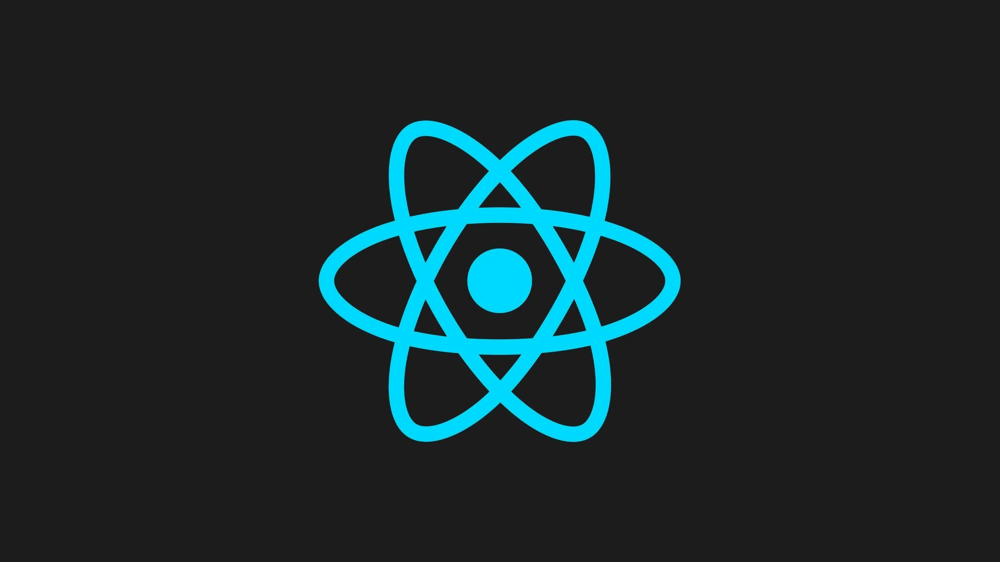

# Boilerplate React + Typescript + Mui + Sass + Eslint + Prettier + MobX + Apisauce


## 📚 Stack & Technologies

- React.js
- Typescript
- ESLint
- Prettier
- Mui
- Sass
- MobX-State-Tree
- Apisauce

You can uninstall anything with `npm uninstall NOMBRE_DEPENDENCIA` everything is listed on the `package.json`. 

## 🏃‍♂️ Run project

Make sure you have node.js and git installed

```
>> git clone https://github.com/jd-apprentice/React-Boilerplate.git

>> cd ./React-Boilerplate

>> npm run install

>> npm run start
```